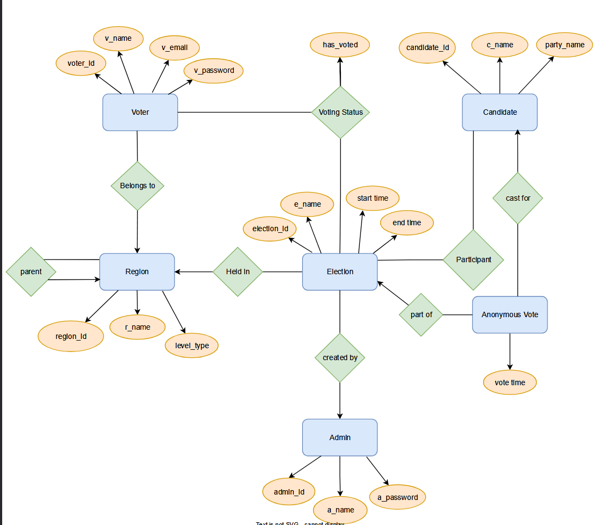
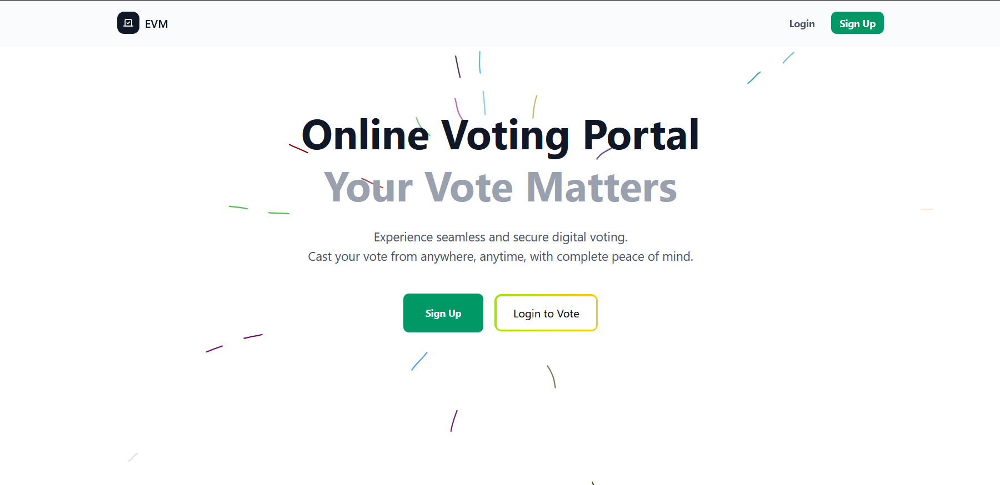
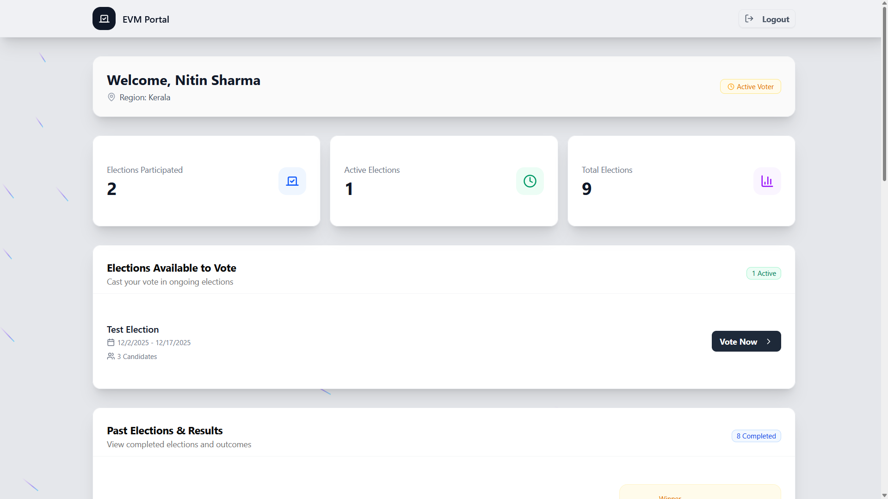
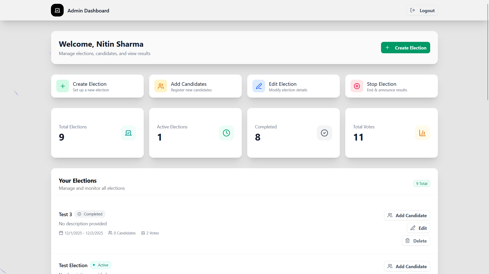
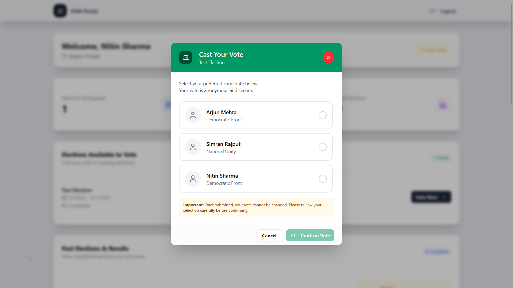
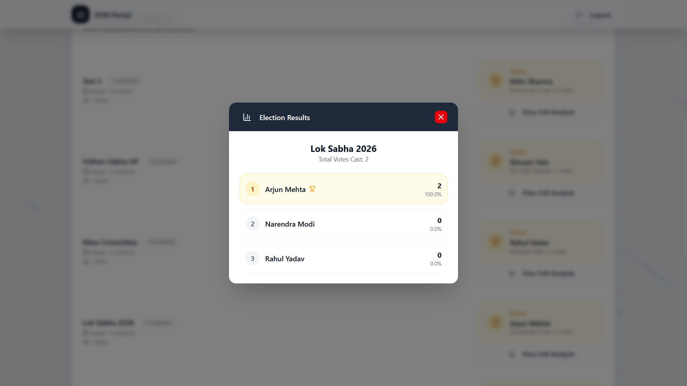

# EVM Voting Portal

A secure, scalable online election system built using Next.js, designed to simulate an EVM-style voting process with strong validation, user authentication, and administrative control.

Users register using verified email OTPs, vote only once, and access responsive dashboards while all votes are stored securely in MySQL.

> Hosted on Vercel: https://evm-portal.vercel.app/

## Features

### Authentication & Access

- Redis-based session management and OTP system
- Email verification before account creation
- Separate dashboards for voters and admins

> [Demo Video](https://youtu.be/hXw9c5eQ3ko?si=9N28HtCFgjVlu59O)

### Voting Integrity

- Prevents double voting
- Maintains voter traceability without exposing identity publicly
- Handles concurrent voting transactions correctly

### System Reliability

- Optimized MySQL relational schema
- Atomic updates ensuring vote integrity
- Redis caching for fast session access

## Tech Stack

### Frontend

- Next.js
- Tailwind CSS / ShadCN UI / Accertainity UI / Radix UI

### Backend

- Next.js App Router APIs

### Database

- MySQL as primary database
- Redis for OTP/session caching

## Database Schema

## Screenshots

### Landing Page

### Voter Dashboard

### Admin Dashboard

### Vote Menu

### Results
